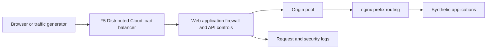

A browser or traffic generator sends requests to an F5 Distributed Cloud load balancer.
The load balancer evaluates the attached web application firewall and API controls. Allowed
requests reach the origin pool, where nginx routes the published application prefix to its
application. A denial must be joined to a security event before you attribute it to a control.

Terraform scaffolds two Azure virtual machines: the origin and the traffic generator.
Shared immutable installers provide the application runtime and traffic catalog. Application
routes and replicas come from the origin manifest, so this repository does not maintain a
second application bootstrap. The declared inventory has nine applications and 42 container
services; those counts do not establish installed or rendered acceptance.

## Applications

| Application and prefix | What to inspect |
| --- | --- |
| Juice Shop: `/juice-shop/` | Products, images, login and basket flows |
| Damn Vulnerable Web Application (DVWA): `/dvwa/` | Authenticated synthetic SQL injection and reflected script behavior |
| VAmPI: `/vampi/` | JSON API, authentication, users and seeded books |
| HTTPBin: `/httpbin/` | Method, path, header and body echoes for policy comparisons |
| whoami: `/whoami/` | Diagnostic request and proxy headers |
| Client-Side Defense (CSD) Demo: `/csd-demo/` | Display activity and checkout navigation |
| Damn Vulnerable GraphQL Application (DVGA): `/dvga/` | GraphQL queries, subscriptions and seeded pastes |
| RESTaurant: `/restaurant/` | Swagger interface, authentication and seeded roles |
| crAPI: `/crapi/` | Synthetic vehicle, community and workshop flows |

Use the published prefixes through the protected domains. Native loopback routes help the
operator diagnose origin behavior, but a direct-origin response cannot replace the protected
before/after request. RESTaurant also offers ReDoc at `/restaurant/redoc`. Application workflow
coverage belongs to the existing implementation acceptance work; these articles cover five
protection categories without describing every catalog scenario.

## Protection and identity

A web application firewall (WAF) detects suspicious request content. API request validation
checks the declared schema. Endpoint rules restrict methods on a path. Rate limiting controls
request frequency for an identified user. Malicious-user detection (MUD) evaluates behavior
across requests; its attached mitigation policy determines the response to a threat level.

The showcase identifies synthetic users from `X-MUD-User`. This controlled identity makes
comparisons reproducible. Customers must choose an identification policy suited to their own
application; an arbitrary client-supplied header is not an authentication mechanism.
HTTPBin has no vulnerable database or object authorization model. Its echoed response proves
that a policy allowed the request to reach an origin.

CSD is disabled in this showcase (`csd_enabled=false`). Its browser scenarios demonstrate
display and cleanup only; the separate [CSD repository](https://github.com/f5-sales-demo/csd)
owns its protection demonstrations.

Continue to [prepare the showcase](../demo/) or [SQL injection and reflected cross-site scripting](../web-application-protection/injection-and-xss/).
