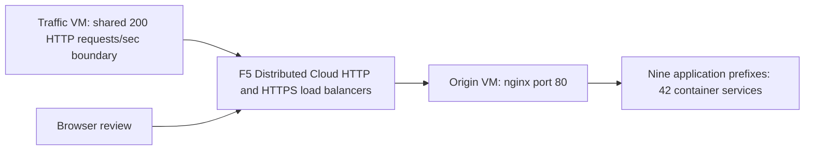

The showcase manages an Azure origin VM, an Azure traffic VM and F5 Distributed Cloud HTTP/HTTPS load balancers with WAF/API policies. The existing namespace, shared DNS and schema fixture have preservation checks. Private local state stays outside Git.

## Shared application inventory

| Application | Published prefix | Replicas | Native loopback ports | Content and workflows |
| --- | --- | --- | --- | --- |
| Juice Shop | `/juice-shop/` | 4 | 3001–3004 | translated-labels, products-and-images, login, basket, supporting-pages, socket-io-affinity |
| DVWA | `/dvwa/` | 4 | 8101–8104 | authenticated-navigation, styles-and-forms, security-settings, seeded-vulnerability-pages |
| VAmPI | `/vampi/` | 4 | 5101–5104 | api-definition, authentication, users, seeded-books |
| HTTPBin | `/httpbin/` | 4 | 8201–8204 | local-swagger-assets, specification, links-and-forms |
| whoami | `/whoami/` | 4 | 8082–8085 | diagnostic-content, proxy-headers |
| CSD Demo | `/csd-demo/` | 4 | 5001–5004 | dashboard, checkout, receiver, counter, clear-log, replica-state |
| DVGA | `/dvga/` | 4 | 5201–5204 | styles-scripts-images, navigation-and-forms, GraphQL, subscriptions, seeded-pastes |
| RESTaurant | `/restaurant/` | 4 | 8301–8304 | swagger, redoc, local-assets, authentication, seeded-roles |
| crAPI | `/crapi/` | 1 | 18888 | login, signup, seeded-vehicle, community, workshop, deep-link-refresh, mailhog |

The authoritative inventory is origin-server `provisioning/applications.json`; nginx/Compose, prefix adapters,
synthetic seeding and JWT repair come from its shared provisioner. WAAP cloud-init verifies installer/archive
digests instead of maintaining a second bootstrap. crAPI uses `/crapi/` through nginx. VAmPI returns JSON;
RESTaurant Swagger is its root and ReDoc is `/restaurant/redoc`.

The generator's immutable installer promotes the shared catalog/runtime. All HTTP scanner, browser, nested
worker and load traffic crosses one pacing boundary: 180 benign plus 20 scenario requests/sec in aggregate.
Connection attempts and held slow connections have separate caps. Fourteen functional contracts are declared
on the reviewed source; installed qualification remains revision-specific and incomplete.

## Controls, state and evidence

The provider pin is `f5-sales-demo/xcsh` 13.0.3 in both roots and the HTTP load-balancer module. The profile requests blocking WAF, API discovery/schema checks, endpoint denial, rate limiting and synthetic-user MUD. CSD enforcement is disabled (`csd_enabled=false`); browser activity proves display execution/cleanup only. Response denial requires independent control attribution.

The [Demo guide](../demo/) uses `deploy`, `verify`, `rebuild` and `destroy` with private local backends and
ownership checks. Current pins and receipts are in the [dated tracker](../origin-traffic-remediation-tasks/).
Upstream merged installation must precede the ownership-checked clean rebuild and final
zero-change/convergence gates. Source tests, a saved plan or old browser matrix do not complete those gates.
